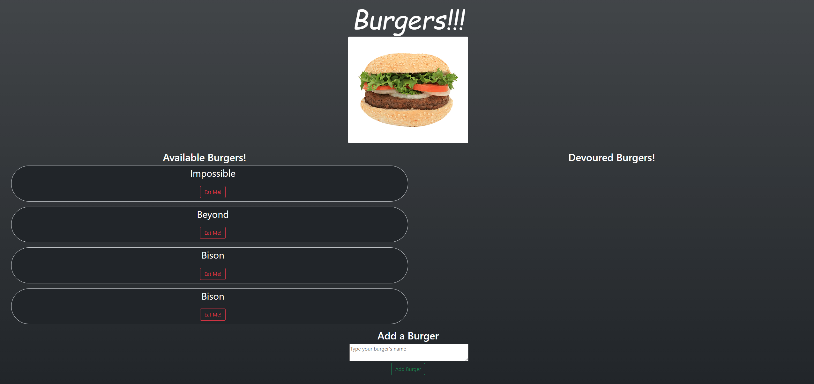
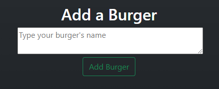
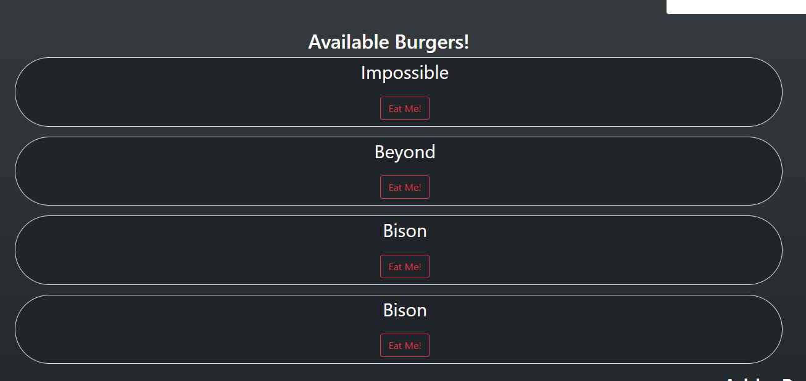

# Da-Burger Joint!

This app has been deployed on [Heroku](https://calm-bayou-87683.herokuapp.com/)

# Introduction

This is a Full Stack app that allows the user to do the following:

<li> Add Burgers to a datbase</li>

#

<li> Eat any available burgers</li>

#

<li> Show a list of eaten burgers</li>

#

# Technologies Used

The following technologies were used in the development:

<li> HTML</li>
<li> CSS</li>
<li> JavaScript</li>
<li> Express</li>
<li> mySQL</li>
<li> Heroku</li>
<li> JawsDB</li>
